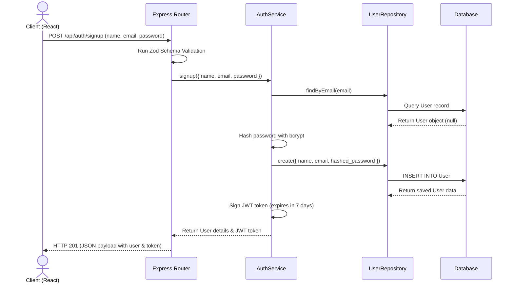
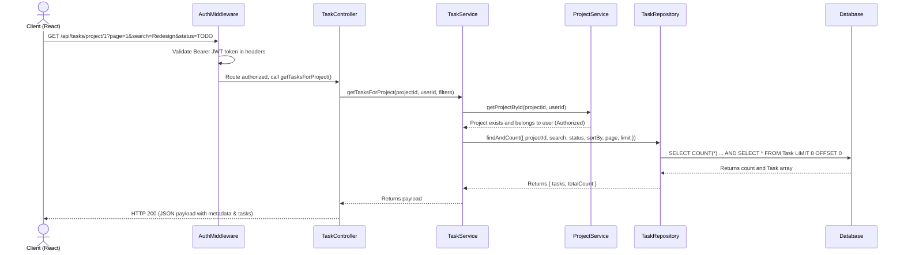
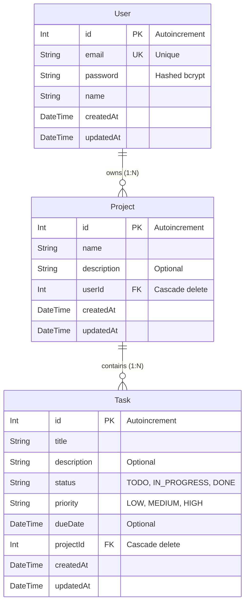

# TaskFlow: Elegant Full-Stack Task & Project Management System

TaskFlow is a production-quality, responsive full-stack task manager. It features a clean, layered architecture and utilizes modern software design principles (Separation of Concerns, MVC, Repository patterns) to provide robust user authentication, project containment, and task tracking.

---

## Technical Stack

*   **Backend**: Node.js, Express.js, Prisma ORM, JWT, bcryptjs, Zod
*   **Frontend**: React, React Router v6, Axios, Tailwind CSS, Lucide Icons
*   **Database**: SQLite (Default for plug-and-play local development) / PostgreSQL (Supported out-of-the-box)

---

## Architectural Flow Diagrams

### User Authentication Flow


### Task Fetching & Filtering Flow


---

## Database ER Diagram (Prisma Model)



---

## Directory Structure

```text
taskflow/
├── backend/
│   ├── prisma/
│   │   ├── migrations/      # Auto-generated SQLite schemas
│   │   └── schema.prisma    # Database Models & provider setup
│   ├── src/
│   │   ├── controllers/     # HTTP routers binding to service calls
│   │   ├── middlewares/     # Auth checks, global errors, Zod validation
│   │   ├── repositories/    # Direct database interface queries (Prisma)
│   │   ├── routes/          # Express route paths mapping
│   │   ├── services/        # Business logical checks and password hashing
│   │   ├── utils/           # Prisma client exports
│   │   ├── validations/     # Zod input schemas definition
│   │   └── index.js         # Express main entry point
│   ├── .env                 # Server configs & SQLite DB URL
│   └── package.json         # Server dependencies
└── frontend/
    ├── src/
    │   ├── components/      # UI components: Modals, Navbar, Sidebar, RouteGuard
    │   ├── context/         # AuthContext provider (JWT state sync)
    │   ├── pages/           # Views: Login, Signup, Dashboard, ProjectDetails
    │   ├── services/        # Axios wrapper client instance
    │   ├── App.jsx          # Route configurations
    │   ├── index.css        # Tailwind styling & Glassmorphic utilities
    │   └── main.jsx         # Client mount entrypoint
    ├── index.html           # Document template
    ├── tailwind.config.js   # Style config
    └── package.json         # Client dependencies
```

---

## API Documentation

All request bodies must use `Content-Type: application/json`.
Protected routes require an `Authorization` header containing `Bearer <your_jwt_token>`.

### Authentication Routes

*   **POST** `/api/auth/signup`
    *   *Description*: Creates a new user account.
    *   *Body*: `{ "name": "John Doe", "email": "john@example.com", "password": "securepassword" }`
*   **POST** `/api/auth/login`
    *   *Description*: Logs in existing users and returns a JWT.
    *   *Body*: `{ "email": "john@example.com", "password": "securepassword" }`
*   **GET** `/api/auth/me` *(Protected)*
    *   *Description*: Returns active user profile decrypted from JWT.
*   **POST** `/api/auth/logout`
    *   *Description*: Confirms session destruction (stateless).

### Project Routes *(All Protected)*

*   **GET** `/api/projects`
    *   *Description*: Retrieves all projects owned by the user.
*   **POST** `/api/projects`
    *   *Description*: Creates a new project.
    *   *Body*: `{ "name": "Project Name", "description": "Optional details" }`
*   **PUT** `/api/projects/:id`
    *   *Description*: Renames/edits a project.
    *   *Body*: `{ "name": "New Name", "description": "New details" }`
*   **DELETE** `/api/projects/:id`
    *   *Description*: Deletes a project and all its nested tasks.

### Task Routes *(All Protected)*

*   **GET** `/api/tasks/project/:projectId`
    *   *Description*: Returns paginated tasks with search filters.
    *   *Query Parameters*:
        *   `page`: (default: `1`) Page number.
        *   `limit`: (default: `8`) Tasks per page.
        *   `search`: Search string (filters task titles or descriptions).
        *   `status`: Filter by status (`TODO`, `IN_PROGRESS`, `DONE`).
        *   `sortBy`: Sort field (e.g. `dueDate`, `createdAt`).
        *   `sortOrder`: Sort direction (`asc`, `desc`).
*   **POST** `/api/tasks`
    *   *Description*: Creates a new task under a project.
    *   *Body*: `{ "title": "Write code", "description": "Details", "status": "TODO", "priority": "HIGH", "dueDate": "2026-07-15T00:00:00Z", "projectId": 1 }`
*   **PUT** `/api/tasks/:id`
    *   *Description*: Updates task attributes.
    *   *Body*: `{ "title": "Updated title", "status": "DONE" }`
*   **DELETE** `/api/tasks/:id`
    *   *Description*: Deletes a task.
*   **GET** `/api/tasks/dashboard/stats`
    *   *Description*: Retrieves summary metrics (Total, Completed, Pending, and Recent Activities) for the dashboard.

---

## Quick Setup (PostgreSQL - Default Config)

Ensure your local PostgreSQL server is active on port `5432`.

### 1. Set Up Backend
1. Open a terminal and navigate to the backend folder:
   ```bash
   cd backend
   ```
2. Install packages:
   ```bash
   npm install
   ```
3. Run the Prisma migration to sync the PostgreSQL database schemas:
   ```bash
   npx prisma migrate dev --name init
   ```
4. Start the Express backend server:
   ```bash
   npm run dev
   ```
   The backend will launch at [http://localhost:5000](http://localhost:5000).

### 2. Run Automated Tests
You can verify the backend endpoints, auth validation middleware, and DB queries using the Jest test suite:
```bash
npm run test
```

### 3. Set Up Frontend
1. Open a new terminal and navigate to the frontend folder:
   ```bash
   cd frontend
   ```
2. Install packages:
   ```bash
   npm install
   ```
3. Start the Vite React development server:
   ```bash
   npm run dev
   ```
   The application will launch at [http://localhost:5173](http://localhost:5173).

---

## Fallback to SQLite

If you wish to run TaskFlow using a self-contained local SQLite file database (zero-configuration):

1.  **Modify the Prisma Schema**:
    Open `backend/prisma/schema.prisma` and edit the `datasource db` block:
    ```prisma
    datasource db {
      provider = "sqlite" // Changed from postgresql to sqlite
      url      = env("DATABASE_URL")
    }
    ```
2.  **Modify the Backend Env**:
    Open `backend/.env` and replace the `DATABASE_URL` with the SQLite file URL:
    ```env
    DATABASE_URL="file:./dev.db"
    ```
3.  **Run Database Migrations**:
    Apply migrations to build the SQLite file structure:
    ```bash
    npx prisma migrate dev --name init
    ```
4.  **Restart Server**:
    Run `npm run dev` to boot the server connected to SQLite.

